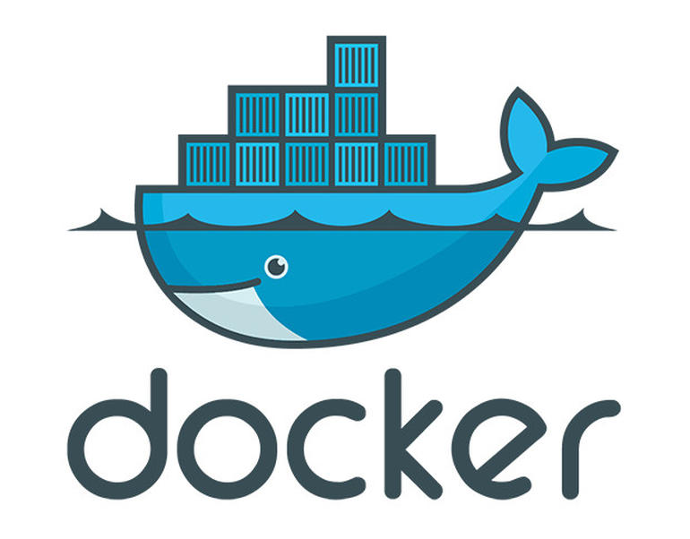

```
$ git clone https://github.com/Thunderguts13/docker_meetup

```

<!-- .slide: class="master01" -->
<!-- section -->
# Docker

<div style="height:300px">

</div>
<!-- .slide: class="master01" -->
<!-- section -->

## Inhalt
* Was ist Docker
* Weshalb Docker

<!-- .slide: class="master03" -->
<!-- section -->

## Was ist Docker

* OS level virtualisierung

<div style="height:480px">

</div>

<!-- .slide: class="master03" -->
<!-- slide -->
## Docker aufbau


<!-- .slide: class="master03" -->
<!-- section -->
# Übung 1

<!-- .slide: class="master03" -->
<!-- section -->
# Übung 2

<!-- .slide: class="master03" -->
<!-- section -->

# Vielen Dank!

<!-- .slide: class="master01" -->
