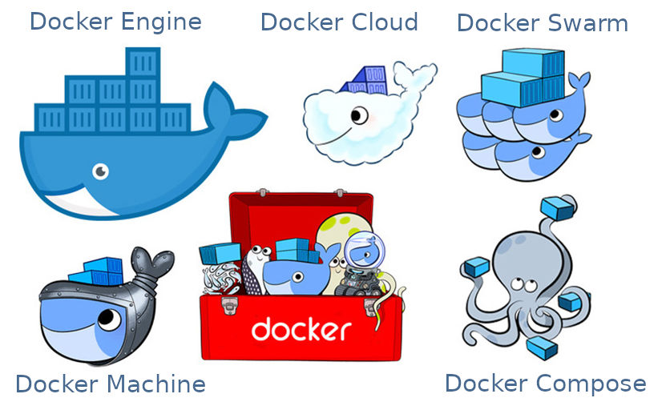
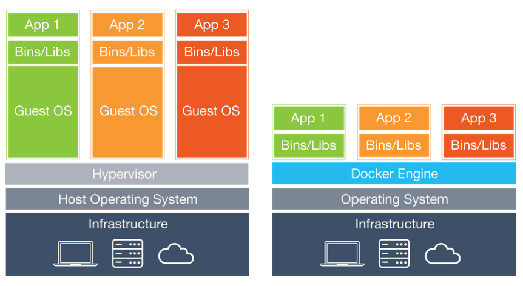
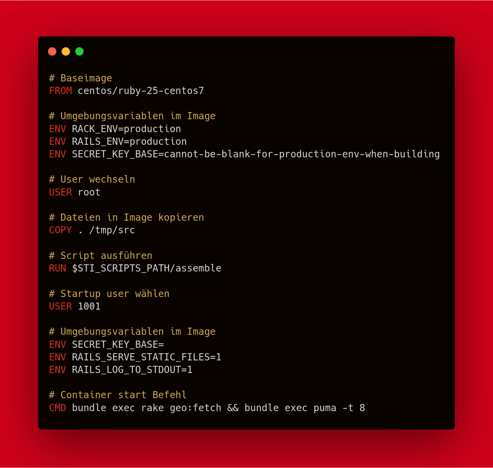
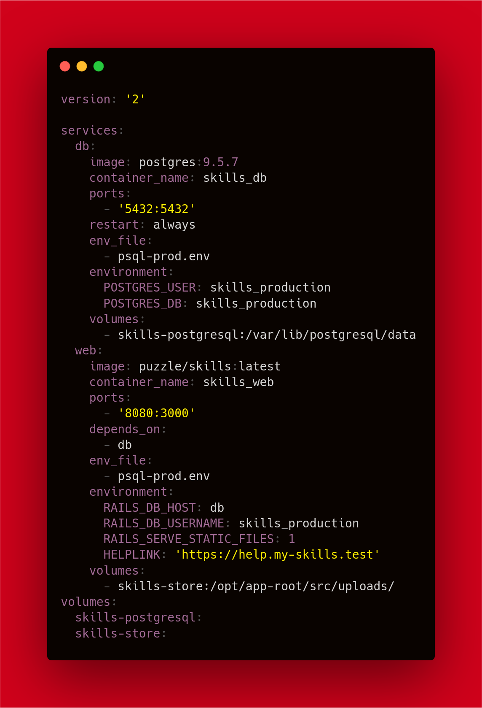

```
$ git clone https://github.com/Thunderguts13/docker_meetup

```

<!-- .slide: class="master01" -->
<!-- section -->
# Docker

<div style="height:300px">

</div>
<!-- .slide: class="master01" -->
<!-- section -->

## Inhalt
* Was ist Docker
* Was sind Container
* Docker Enginge Aufbau
* Übung 1
* Dockerfile
* Übung 2
* Docker-compose
* Übung 3
* Security

<!-- .slide: class="master03" -->
<!-- section -->

## Was ist Docker

* 2010 dotCluod gegründet
* 2013 Docker umbenannt
* 2015 1 Milliarde wert
* 2019 Von Mirantis aufgekauft

<!--
Docker ist eine Firma Docker incorporated welche OpenSource Produkte anbietet zum Verwalten von Containern.
Dies sind die wichtigsten Meilensteine von Docker.
2010 gegründet
2013 RedHat Allianz für Openshift und Umbenennung zu Docker
 ---Folie---
-->
<!-- .slide: class="master03" -->
<!-- slide -->
#### Was bietet Docker
<div style="height:480px">

</div>
<!--
Dies sind die Produkte von Docker.
--Docker swarm ist zum orchestrieren von Containern wie z.B. Kubernetes oder Openshift
--Docker machine ist für alte Mac/Windows maschinen
--Docker cloud deployment/managment auf Colud providers
--Docker compose ist zum Verwalten von mehreren Containern
--Docker engine ist eigentlich das Herz von Docker. All diese Services verwenden die Engine zum erstellen und verwalten von Containern
Wir werden heute primär Docker Engine und Docker Compose anschauen
Da dies die gängigsten Tools sind welche in der Entwicklung eingesetzt werden.
-->

<!-- .slide: class="master03" -->
<!-- section -->

## Was ist ein Container
 * Packet aus Applikation und Dependencies
 * Os-level virtualisierung
 * Isoliert vom System

<!--
Container sind nicht nur von Docker erhältlich, Container sind ein standartisiertes Softwarepacket welche den Applikationscode und alle dependencies beinhaltet. 
Ein Container ist eine Art von Virtualisierung genauer gesagt os-level-virtualisierung. Dies beduetet, dass der Container nicht auf dem OS läuft sondern als Subprozess auf dem kernel. Damit der Container isoliert ist vom Rest vom System ist er in einem eigenen user space. Der Container sieht vom Gerät nur die Ressourcen welche ihm zu Verfügung gestellt werden. Da der Container keinen eigenen Kernel benötigt ist er einiges schmaller als traditionelle Virtualisierung mit Virtualbox oder Hypervisor.


 -->

<!-- .slide: class="master03" -->
<!-- slide -->

<div style="height:480px">

</div>

<!-- Auf dieser Grafik erkennt man gut was dies Stacktechnisch ausmacht. Ein Container hat einiges weniger an Overhead im Vergleich zu einer Virtual Machine. Aus diesem Grund sind Container einiges Rssourcen schonender als eine Virtualmachine, dies ermöglicht es auf weniger Maschinen mehr Applikationen zu Deployen. Ein Nachteil gegenüber Virtualmachines ist man kann nur Linux containerisieren. Man kann keine alte Spielkonsole emulieren, kein Windows 95 starten, weil der Kernel vom HostOs verwendet wird.
-->
<!-- .slide: class="master03" -->
<!-- section -->
## Docker Enginge Aufbau


<!--
Diese Grafik zeigt den Aufbau vom Docker Ökosystem auf. Hier haben wir noch zwei drei Begriffe die wir nocht nicht kennen. Der Daemon ist grundsätzlich ein Prozess der im Hintergrund läuft auf dem System. Dies spezifisch ist der Docker daemon. Images sind die Basis für Container. Mit einem Image kann man mehrere Container starten. Die Registry ist ein Lager von Images entweder Docker hub oder ein Internes Speicher Tool zum Images ablegen. Wie ihr seht hat es Linien die uns erklären wie dies Sache läuft. Der Client setzt einen Befehl ab welcher dann vom Daemon umgesetzt wird. Der erste Befehl ist Build Da sagt Der Client das der Daemon ein Image erstellen soll. Dies passiert mit einem Dockerfile als Basis. Das Image ist dan Lokal auf dem Host abgelegt. Der nächste Befehl ist pull, Pull holt ein Image aus der Registry auf den Host. Jedoch der interessanteste Befehl ist run. Mit run kann man ein image angeben und einen Container starten. run kann falls das Image lokal nicht vorhanden ist es von der Registry herunterladen.
-->
<!-- .slide: class="master03" -->
<!-- slide -->
# Übung 1
```
$ git clone https://github.com/Thunderguts13/docker_meetup

```
<!--
Als erste Übung werden wir einen Container erstellen. Der einfachste Weg um dies zu machen ist mit docker run <image_name>. Könnt alle mal bei euch im Terminal disen Befehl eingeben uns schauen was passiert. Wie ihr seht schaut Docker lokal nach dem Image. Da Das Image lokal nicht vorhanden ist wird das image von Dockerhub heruntergeladen. Wenn dies abgeschlossen ist wird der Container gestartet und somit auch das Ruby script im Container.

Mit docker ps könnt ihr anschauen welche Container am laufen sind. [DOCKER PS OUTPUT ERKLÄREN] Falls man genug von einem Container hat kann dieser mit docker kill <container_name> gestoppt werden. Um ihn zu wieder zu starten kann man docker start -a meetup eingeben.

Es gibt die Möglichkeit in einen Container reinzugehen dies kann man mit docker exec -it <container_name> /bin/sh machen.
 -->
<!-- .slide: class="master03" -->
<!-- section -->
## Dockerfile
#### Anleitung für ein Image


<!-- .slide: class="master03" -->
<!-- slide -->
<div style="height:680px">

</div>

<!--
Dies ist das Dockerfile von Cryptopus.
 -->

<!-- .slide: class="master03" -->
<!-- slide -->

# Übung 2

<!--
Als zweite Übung werden wir ein Dockerfile erstellen. Im Script Ordner habt ihr ein Ruby script. Die Aufgabe ist es ein Dockerfile zu schreiben für dieses Script.
 -->

<!-- .slide: class="master03" -->
<!-- section -->

## Docker-compose

* Mehrere Container
* Volumes
* Netzwerk

<!-- 
Compose ermöglich das verwalten von mehreren Containern gleichzeitig. Das bedeutet zum Beispiel, dass die Applikation in einem Container und die Datenbank in einem anderen Container gestartet werden können. Dies funktioniert auch ohne compose jedoch wird es mit compose einiges vereinfacht. Compose ermöglich es mit einem einzigen Befehl. Compose macht noch einige zusätzliche Sachen um die ganze sache zu vereinfachen. Es ermöglicht es Vloumes ganz einfach zu erstellen so dass die Daten persisstent sind auch wenn der Container gelöscht wird. Die Kommunikation zwischen Container wird auch einiges vereinfacht. Die Container müssen nicht mehr via IP kommunizieren sondern via Container Name.
 -->
<!-- .slide: class="master03" -->
<!-- slide -->


<div style="height:680px">

</div>

<!-- .slide: class="master03" -->
<!-- slide -->

# Übung 3
<!-- 
Docker compose für entweder Cryptopus oder pfeedback
 -->
<!-- .slide: class="master03" -->
<!-- section -->

## Security
* root
* Secrets
* Source Image

<!--
Ein Container sollte niemals als root gestartet werden. Sonst hat der Container root zugriff auf den Dockerhost. Um dies zu verhindern muss man am ende des Dockerfiles noch user wechseln. Am besten wählt man einen User mit möglichst wenigen Rechten. Falls das Baseimage dies nicht bietet kann man einen User erstellen.
-->

<!-- .slide: class="master03" -->
<!-- section -->

# Vielen Dank!

<!-- .slide: class="master01" -->
